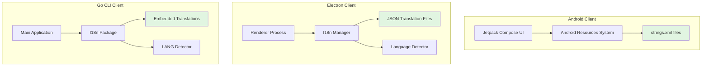
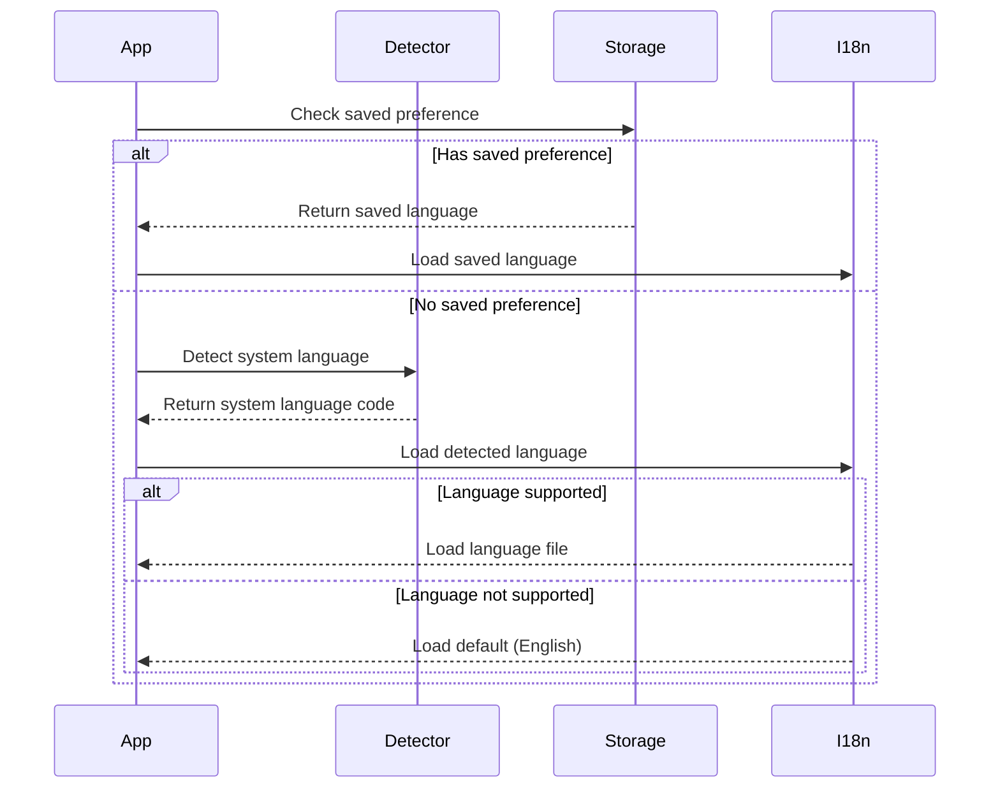

# Design Document: Multi-Language Support

## Overview

This design implements internationalization (i18n) for the DNSTT Messenger application across three client platforms: Android (Kotlin/Jetpack Compose), Electron (JavaScript/HTML), and Go CLI. The system will support seven languages with a focus on countries experiencing internet censorship: Chinese (zh), Farsi (fa), Russian (ru), Arabic (ar), Turkish (tr), Vietnamese (vi), and English (en) as the default.

The design follows platform-native approaches: Android uses the standard resource system (strings.xml), Electron uses JSON-based translation files with dynamic loading, and Go embeds JSON translations in the binary. Each platform implements automatic language detection from system settings with manual override capabilities.

Key design principles:
- Platform-native implementation patterns for optimal integration
- Graceful fallback to English when translations are missing
- Offline-first operation with embedded translations
- Performance-conscious with lazy loading and caching
- RTL (right-to-left) support for Arabic and Farsi

## Architecture

### High-Level Architecture



### Translation File Structure

All platforms share a common translation key namespace for consistency:

```
app.name
login.title
login.username
login.password
login.button.submit
login.button.register
login.error.invalid_credentials
chat.title
chat.input.placeholder
chat.button.send
chat.online_count
settings.title
settings.server_address
settings.proxy_address
settings.direct_mode
settings.language
error.connection_failed
error.network_timeout
notification.new_message
dm.title
dm.new_conversation
room.create
room.join
room.leave
room.invite
room.members_count
```

### Language Detection Flow



## Components and Interfaces

### Android Client Components

#### 1. Resource Files Structure
```
res/
├── values/              # Default (English)
│   └── strings.xml
├── values-zh/           # Chinese
│   └── strings.xml
├── values-fa/           # Farsi
│   └── strings.xml
├── values-ru/           # Russian
│   └── strings.xml
├── values-ar/           # Arabic
│   └── strings.xml
├── values-tr/           # Turkish
│   └── strings.xml
└── values-vi/           # Vietnamese
    └── strings.xml
```

#### 2. Locale Configuration
Android automatically handles locale detection and resource selection. The application will use `LocaleListCompat` for programmatic language switching.

**Interface:**
```kotlin
object LocaleManager {
    fun getCurrentLocale(context: Context): Locale
    fun setLocale(context: Context, languageCode: String)
    fun getSupportedLanguages(): List<Language>
}

data class Language(
    val code: String,
    val displayName: String,
    val nativeName: String
)
```

### Electron Client Components

#### 1. I18n Manager Module

**File:** `electron-client/i18n/manager.js`

```javascript
class I18nManager {
    constructor() {
        this.currentLanguage = 'en';
        this.translations = {};
        this.fallbackLanguage = 'en';
        this.supportedLanguages = ['en', 'zh', 'fa', 'ru', 'ar', 'tr', 'vi'];
    }
    
    async loadLanguage(languageCode);
    translate(key, params = {});
    detectSystemLanguage();
    setLanguage(languageCode);
    getCurrentLanguage();
    getSupportedLanguages();
}
```

#### 2. Translation Files

**Location:** `electron-client/i18n/locales/`

**Format:**
```json
{
    "app.name": "DNSTT Messenger",
    "login.title": "Login",
    "login.username": "Username",
    "chat.online_count": "{count} online",
    "chat.online_count_plural": "{count} users online"
}
```

#### 3. RTL Support

For Arabic and Farsi, the application will dynamically set the `dir` attribute on the HTML root element:

```javascript
function setTextDirection(languageCode) {
    const rtlLanguages = ['ar', 'fa'];
    const direction = rtlLanguages.includes(languageCode) ? 'rtl' : 'ltr';
    document.documentElement.setAttribute('dir', direction);
}
```

### Go Client Components

#### 1. I18n Package

**File:** `client/i18n/i18n.go`

```go
package i18n

import (
    "embed"
    "encoding/json"
)

//go:embed locales/*.json
var localesFS embed.FS

type Manager struct {
    currentLanguage string
    translations    map[string]string
    fallback        map[string]string
}

func NewManager() *Manager
func (m *Manager) LoadLanguage(code string) error
func (m *Manager) T(key string, params ...interface{}) string
func (m *Manager) DetectLanguage() string
func (m *Manager) SetLanguage(code string) error
func (m *Manager) GetSupportedLanguages() []string
```

#### 2. Translation Files

**Location:** `client/i18n/locales/`

Files: `en.json`, `zh.json`, `fa.json`, `ru.json`, `ar.json`, `tr.json`, `vi.json`

#### 3. Language Detection

The Go client will detect language from:
1. Command-line flag: `--lang=zh`
2. Config file: `client_config.json` → `"language": "zh"`
3. Environment variable: `LANG=zh_CN.UTF-8` → extract `zh`
4. Default to English if none found

### Shared Translation Keys

To maintain consistency across platforms, all three clients will use the same translation key structure. A validation script will ensure key parity.

## Data Models

### Translation Entry

```typescript
interface TranslationEntry {
    key: string;           // e.g., "login.button.submit"
    value: string;         // e.g., "Submit" or "提交"
    params?: string[];     // e.g., ["username", "count"]
    pluralForms?: {
        zero?: string;
        one?: string;
        many?: string;
    };
}
```

### Language Metadata

```typescript
interface LanguageMetadata {
    code: string;          // ISO 639-1 code
    name: string;          // English name
    nativeName: string;    // Native name
    rtl: boolean;          // Right-to-left flag
    pluralRules: string;   // CLDR plural rule identifier
}
```

### Supported Languages

```javascript
const SUPPORTED_LANGUAGES = [
    { code: 'en', name: 'English', nativeName: 'English', rtl: false },
    { code: 'zh', name: 'Chinese', nativeName: '中文', rtl: false },
    { code: 'fa', name: 'Farsi', nativeName: 'فارسی', rtl: true },
    { code: 'ru', name: 'Russian', nativeName: 'Русский', rtl: false },
    { code: 'ar', name: 'Arabic', nativeName: 'العربية', rtl: true },
    { code: 'tr', name: 'Turkish', nativeName: 'Türkçe', rtl: false },
    { code: 'vi', name: 'Vietnamese', nativeName: 'Tiếng Việt', rtl: false }
];
```

### Configuration Storage

**Android:** SharedPreferences
```kotlin
data class I18nPreferences(
    val selectedLanguage: String? = null,
    val useSystemLanguage: Boolean = true
)
```

**Electron:** config.json
```json
{
    "language": "zh",
    "use_system_language": false
}
```

**Go:** client_config.json
```json
{
    "language": "zh",
    "proxy_addr": "127.0.0.1:18000",
    "server_addr": "127.0.0.1:9999"
}
```

## Error Handling

### Translation Loading Errors

1. **Missing Translation File**
   - Behavior: Log warning, fall back to default language (English)
   - User Impact: Application continues in English
   - Example: User selects Turkish but `tr.json` is corrupted
   - Recovery: Load `en.json` and display notification

2. **Malformed JSON**
   - Behavior: Catch parse exception, log error with file details
   - User Impact: Fall back to default language
   - Recovery: Validate JSON structure on startup, use last known good configuration

3. **Missing Translation Keys**
   - Behavior: Return key from fallback language (English)
   - User Impact: Some text appears in English while rest is translated
   - Example: New feature added but translations not yet complete
   - Recovery: Display translation key itself if missing in both current and fallback

4. **Invalid Language Code**
   - Behavior: Validate against supported languages list
   - User Impact: Reject invalid selection, keep current language
   - Recovery: Show error message, provide language picker

### Platform-Specific Error Handling

**Android:**
- Resource loading failures: Use `try-catch` around resource access, fall back to default resources
- Configuration persistence errors: Log error, continue with in-memory state
- Locale switching errors: Revert to previous locale, show toast notification

**Electron:**
- File system errors: Handle `ENOENT`, `EACCES` with graceful degradation
- IPC communication errors: Retry mechanism for language change requests
- Renderer crash: Persist language preference to survive restarts

**Go:**
- Embed FS errors: Should never occur in production (compile-time embedding)
- Environment variable parsing: Handle malformed `LANG` values with regex validation
- Config file errors: Create default config if missing, validate JSON schema

### Fallback Chain

```
User Selection → Saved Preference → System Language → Default (English) → Hardcoded Strings
```

Each step in the chain has error handling to proceed to the next level if it fails.

### Error Messages

All error messages related to i18n failures will themselves be hardcoded in English to avoid circular dependency:

```javascript
const I18N_ERROR_MESSAGES = {
    LOAD_FAILED: 'Failed to load language file. Using English.',
    INVALID_CODE: 'Invalid language code. Please select from available languages.',
    PARSE_ERROR: 'Translation file is corrupted. Using English.',
    KEY_MISSING: 'Translation missing for key: {key}'
};
```

## Testing Strategy

### Overview

This feature does not use property-based testing because:
- Translation correctness is about human language quality, not algorithmic properties
- The feature primarily involves configuration management, file I/O, and UI rendering
- Testing focuses on integration between components and specific scenarios

Testing will use:
- Unit tests for translation loading and key lookup logic
- Integration tests for language switching across platforms
- Manual testing for translation quality and UI layout
- Validation scripts for translation file completeness

### Unit Tests

**Android (Kotlin + JUnit):**

```kotlin
class LocaleManagerTest {
    @Test
    fun `getCurrentLocale returns system locale by default`()
    
    @Test
    fun `setLocale updates app locale and persists preference`()
    
    @Test
    fun `getSupportedLanguages returns all seven languages`()
    
    @Test
    fun `unsupported locale falls back to English`()
}

class StringResourceTest {
    @Test
    fun `all translation keys exist in default strings xml`()
    
    @Test
    fun `all language folders have strings xml file`()
    
    @Test
    fun `RTL languages have proper layout direction`()
}
```

**Electron (Jest):**

```javascript
describe('I18nManager', () => {
    test('loads English translations by default', async () => {});
    
    test('falls back to English when translation file missing', async () => {});
    
    test('translate() returns correct value for key', () => {});
    
    test('translate() handles missing keys gracefully', () => {});
    
    test('translate() substitutes parameters correctly', () => {});
    
    test('detectSystemLanguage() returns valid language code', () => {});
    
    test('setLanguage() updates current language and saves preference', async () => {});
    
    test('RTL languages set dir attribute to rtl', () => {});
});

describe('Translation Files', () => {
    test('all translation files are valid JSON', () => {});
    
    test('all files have same keys as English', () => {});
    
    test('no duplicate keys within a file', () => {});
    
    test('placeholder variables match across languages', () => {});
});
```

**Go (testing package):**

```go
func TestNewManager(t *testing.T)
func TestLoadLanguage(t *testing.T)
func TestTranslate(t *testing.T)
func TestTranslateMissingKey(t *testing.T)
func TestDetectLanguageFromEnv(t *testing.T)
func TestDetectLanguageFromConfig(t *testing.T)
func TestSetLanguage(t *testing.T)
func TestFallbackToEnglish(t *testing.T)
func TestEmbeddedFilesExist(t *testing.T)
func TestAllLanguagesHaveSameKeys(t *testing.T)
```

### Integration Tests

**Android:**
- Test language switching updates all visible UI elements
- Test app restart preserves language selection
- Test system language change triggers UI update
- Test RTL layout for Arabic and Farsi

**Electron:**
- Test language switching without app restart
- Test IPC communication between main and renderer for language changes
- Test persistence of language preference across app restarts
- Test notification text uses correct language

**Go:**
- Test `--lang` flag overrides system language
- Test config file language preference
- Test LANG environment variable parsing
- Test all console output uses correct language

### Translation Validation Script

A Node.js script to validate translation files:

```javascript
// scripts/validate-translations.js
const fs = require('fs');
const path = require('path');

function validateTranslations() {
    const baseFile = 'en.json';
    const baseKeys = Object.keys(JSON.parse(fs.readFileSync(baseFile)));
    
    const languages = ['zh', 'fa', 'ru', 'ar', 'tr', 'vi'];
    
    for (const lang of languages) {
        const file = `${lang}.json`;
        const translations = JSON.parse(fs.readFileSync(file));
        const keys = Object.keys(translations);
        
        // Check for missing keys
        const missing = baseKeys.filter(k => !keys.includes(k));
        if (missing.length > 0) {
            console.error(`${lang}: Missing keys:`, missing);
        }
        
        // Check for extra keys
        const extra = keys.filter(k => !baseKeys.includes(k));
        if (extra.length > 0) {
            console.warn(`${lang}: Extra keys:`, extra);
        }
        
        // Check coverage percentage
        const coverage = (keys.length / baseKeys.length) * 100;
        console.log(`${lang}: ${coverage.toFixed(1)}% coverage`);
    }
}
```

This script will be run in CI/CD to ensure translation completeness.

### Manual Testing Checklist

For each supported language:
- [ ] All UI text is translated (no English mixed in)
- [ ] Text fits within UI elements (no truncation)
- [ ] RTL languages display correctly (Arabic, Farsi)
- [ ] Pluralization works correctly for counts
- [ ] Date/time formatting is locale-appropriate
- [ ] Error messages are translated
- [ ] Notification text is translated
- [ ] Settings UI shows language in native script

### Performance Testing

- Measure app startup time with different languages (should be < 100ms difference)
- Measure language switching time (should be < 500ms per requirement)
- Measure memory usage of loaded translations (should be < 100KB per language)
- Verify no file I/O during normal translation lookups

### Acceptance Testing

Each requirement from the requirements document will be verified:

**Requirement 1:** Language Detection and Selection
- Verify automatic detection on first launch
- Verify manual selection persists across restarts
- Verify all seven languages are supported

**Requirement 2:** Translation File Management
- Verify JSON format and organization
- Verify fallback behavior for missing keys
- Verify offline operation with embedded files

**Requirement 3-5:** Platform-Specific Implementation
- Verify each platform uses appropriate i18n approach
- Verify all UI elements are translated
- Verify language switching works correctly

**Requirement 6:** Translation Completeness
- Run validation script to verify 95%+ coverage
- Verify no HTML or code in translation files

**Requirement 7:** Dynamic Text and Pluralization
- Test placeholder substitution with various inputs
- Test plural forms for each language's grammar rules

**Requirement 8:** Fallback and Error Handling
- Test with missing translation files
- Test with corrupted JSON
- Verify app remains functional

**Requirement 9:** Testing and Validation
- Run validation tool on all translation files
- Verify unit tests pass on all platforms

**Requirement 10:** Performance
- Verify startup time impact < 500ms
- Verify language switching < 500ms
- Verify binary size increase < 500KB per language

